# Project

순환신경망(RNN)을 이용한 뉴스 카테고리 분류 실습 프로젝트입니다.


## 기술스택

### Python

- 데이터 파싱
- 데이터 전처리
- 데이터 분석
- 모델링

### Flask

- web

### Docker

- Dockerfile과 docker-compose를 통한 이미지 생성

### GCP

- 인스턴스 생성과 로드밸런싱을 사용한 서버 배포


### 프로젝트

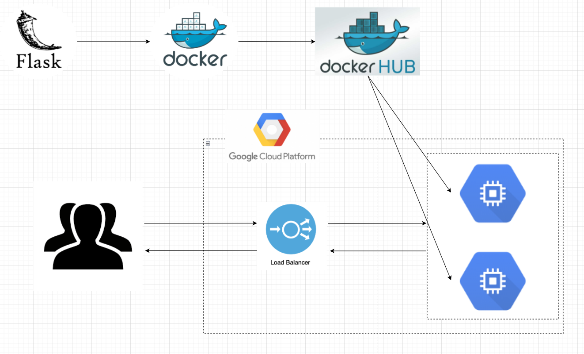


### 프로젝트 흐름도

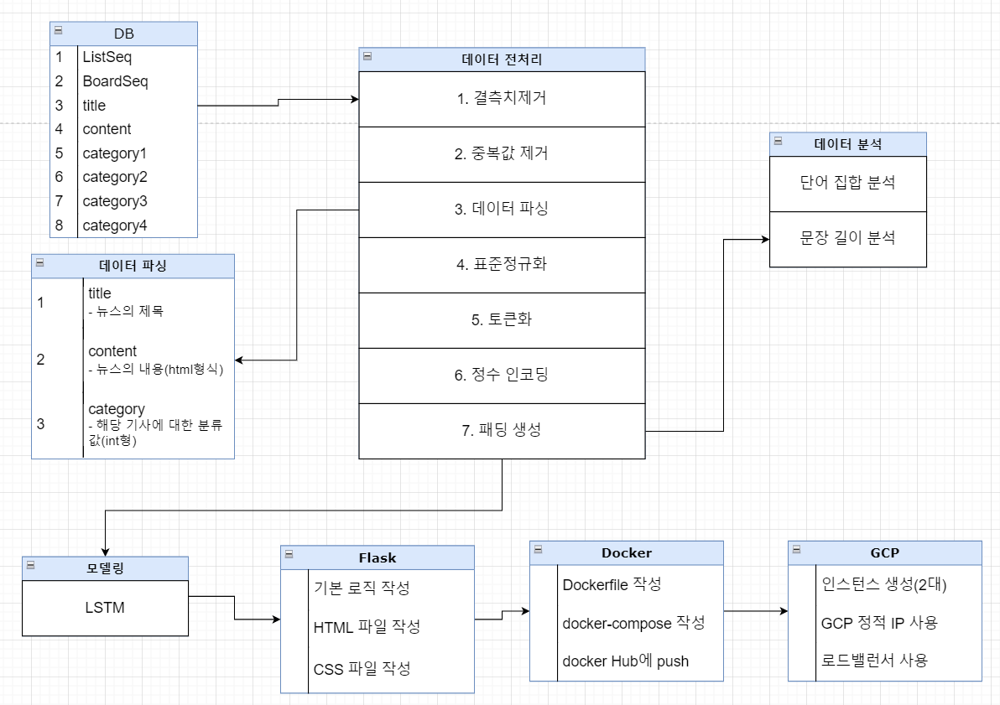


## 데이터 분석 및 모델링

### title의 문장 길이 분포도

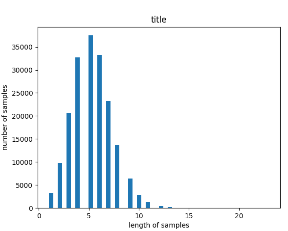

- title의 길이 10미만


### content의 문장 길이 분포도

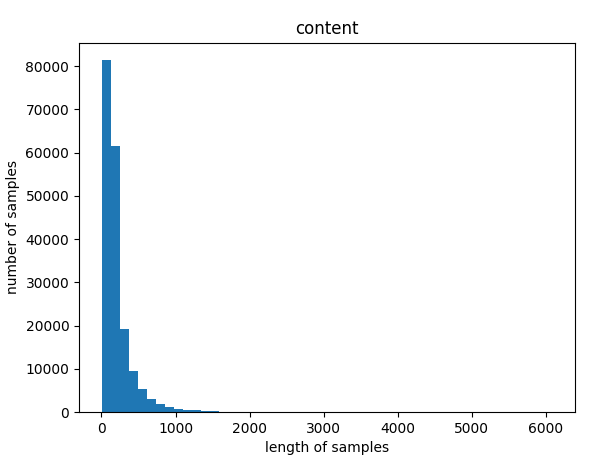

- content의 길이 700미만


### train(title+content)의 문장 길이 분포도

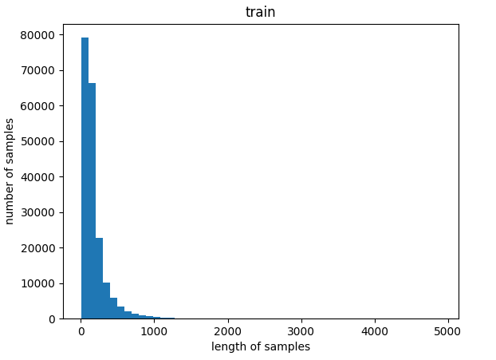

- train의 길이 700미만  비율


## 모델링

### title 모델 summary

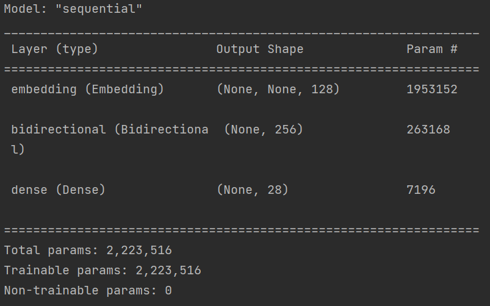

### content 모델 및 train 모델 summary

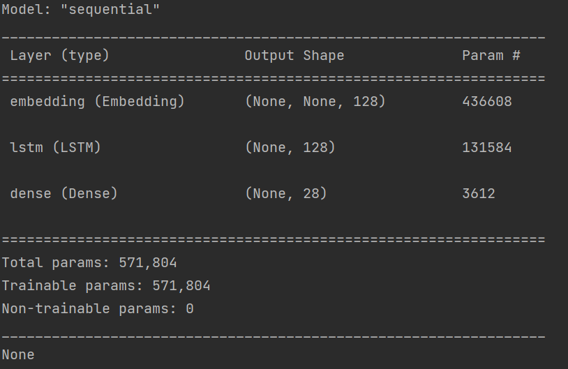


### 정확도

- title_model 정확도


- content_model 정확도


- train_model 정확도


### 모델 history, loss

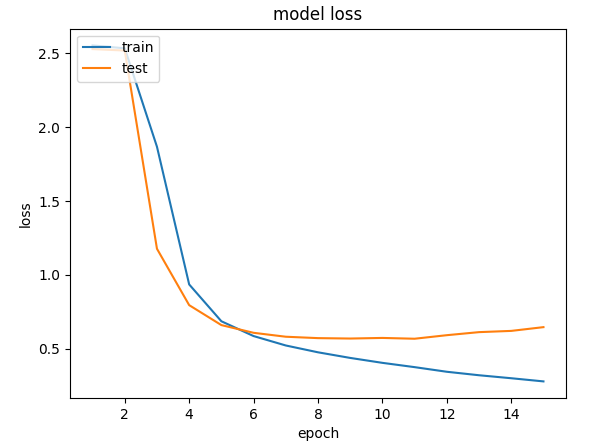


## 모델 정리

### 임베딩 layer

```python
encoded_text = [[0, 1, 2, 3, 4],[5, 1, 2, 3, 6]]
vocab_size = 7
embedding_dim = 2
Embedding(vocab_size, embedding_dim, input_length=5)

# ex)
+------------+------------+
|   index    | embedding  |
+------------+------------+
|     0      | [1.2, 3.1] |
|     1      | [0.1, 4.2] |
|     2      | [1.0, 3.1] |
|     3      | [0.3, 2.1] |
|     4      | [2.2, 1.4] |
|     5      | [0.7, 1.7] |
|     6      | [4.1, 2.0] |
+------------+------------+
```

- 첫번째 인자 : 단어 집합의 크기. 즉, 총 단어의 개수
- 두번째 인자 : 임베딩 벡터의 출력 차원. 결과로서 나오는 임베딩 벡터의 크기
- **input_length** = 입력 시퀀스의 길이


### LSTM layer

```python
model.add(LSTM(hidden_size, input_shape=(timesteps, input_dim)
```

- hidden_size : 은닉 상태의 크기를 정의. 메모리 셀이 다음 시점의 메모리 셀과 출력층으로 보내는 값의 크기(output_dim)와도 동일. RNN의 용량(capacity)을 늘린다고 보면 되며, 중소형 모델의 경우 보통 128, 256, 512, 1024 등의 값을 가진다.
- input_shape : 현재 레이어를 모델의 첫 번째 레이어로 사용하는 경우 요구됨
  - timesteps : 시점의 수 = 각 문서에서의 단어 수.
  - input_dim : 입력의 크기 = 각 단어의 벡터 표현의 차원 수.

- 추가 내용
  - 바닐라 RNN은 비교적 짧은 시퀀스(sequence)에 대해서만 효과를 보이는 단점이 존재
  - 따라서 시점(time step)이 길어질 수록 앞의 정보가 뒤로 충분히 전달되지 못하는 현상이 발생(장기 의존성 문제)
  - LSTM은 은닉상태를 계산하는 식이 조금 더 복잡해졌으며 셀 상태라는 값이 추가되어 기존의 장기 의존성 문제를 극복하기 위한 모델
  - 은닉 상태 : 메모리 셀이 출력층 방향 또는 다음 시점인 t+1의 자신에게 보내는 값

#### RNN 개념


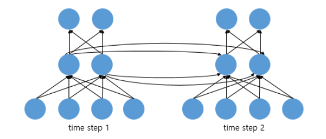

#### 바닐라 RNN

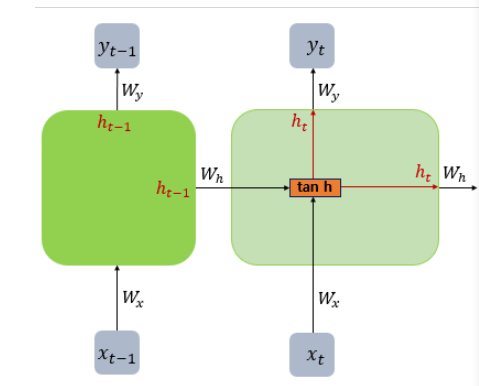

#### LSTM(Long Short-Term Memory)

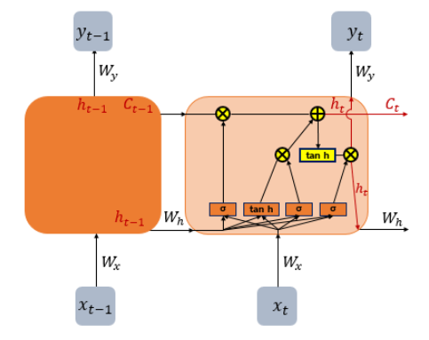

#### Bidirectional(LSTM)

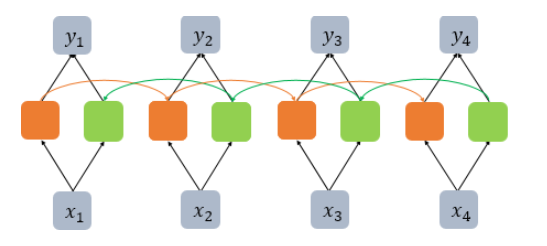


### Dense layer

```python
model.add(Dense(28, input_dim=int, activation='softmax'))
```

- 첫번째 인자 = 출력 뉴런의 수.
- **input_dim** = 입력 뉴런의 수. (입력의 차원)

- activation : 활성화함수
  - softmax : 다중 클래스 분류 문제에서 출력층에 주로 사용되는 활성화 함수.

